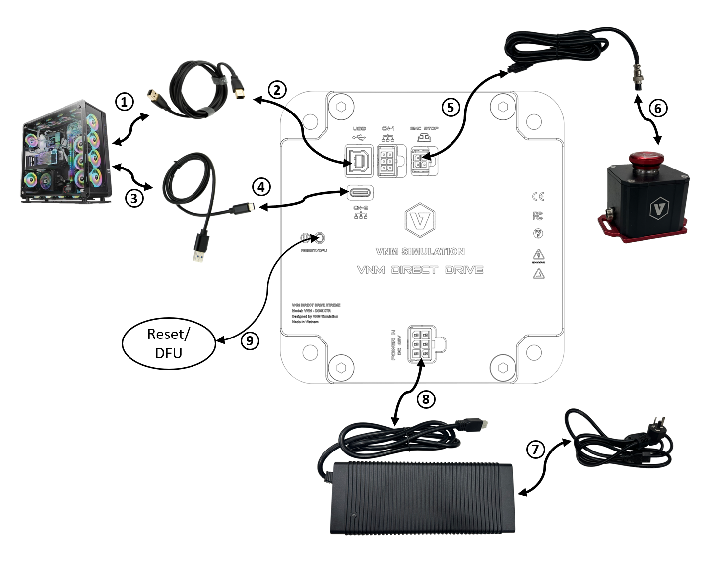
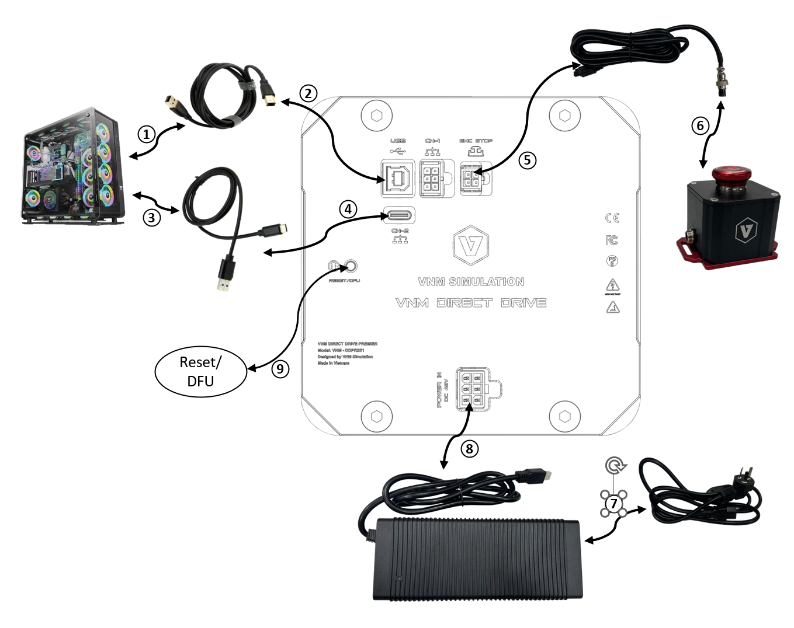

# Connection

Figure 12. Connection ports of VNM Wheelbase.

Figure 13. Connection ports of VNM Wheelbase Supreme

Wheelbase Premier, Lite uses a normal EMC Stop Button, and lower power adapters which has different appearance and the connection are same with the wheelbase Supreme.

CN-4 is used for future use.

**Disclaimer:**

Please note that the appearance of VNM wheelbases may vary from the illustrations in this User Manual and from the product images on the VNM Simulation website (<https://vnmsimulation.com>)
