# Wheelbase Mounting Pattern

## 2.1. Front mounting pattern
All wheelbase of VNM has same front mounting pattern as following:

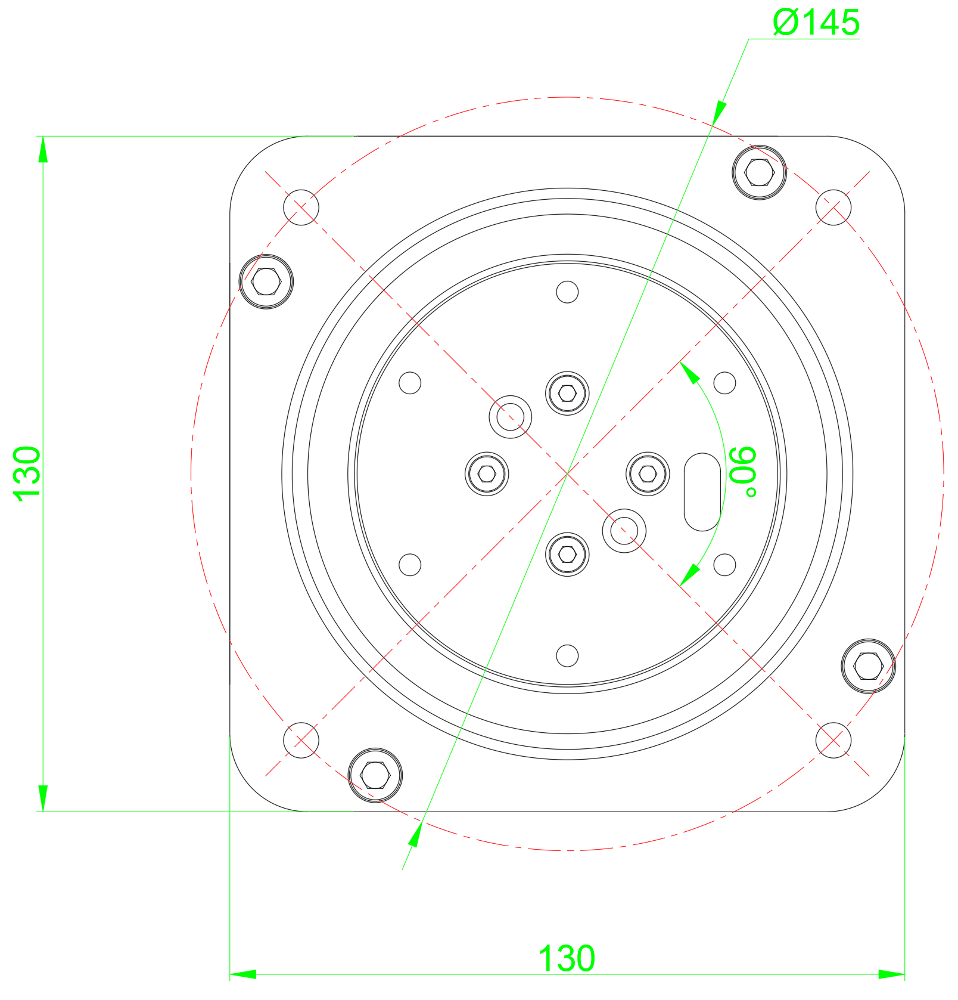

Figure 1. VNM Wheelbase Front dimensions

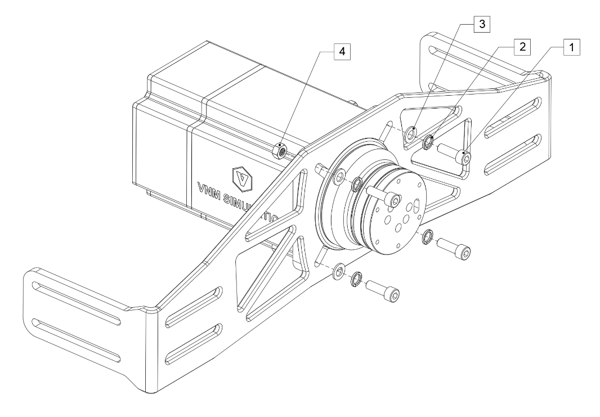

Figure 2. Mounting VNM Wheelbase on a simulator rig front mount bracket.

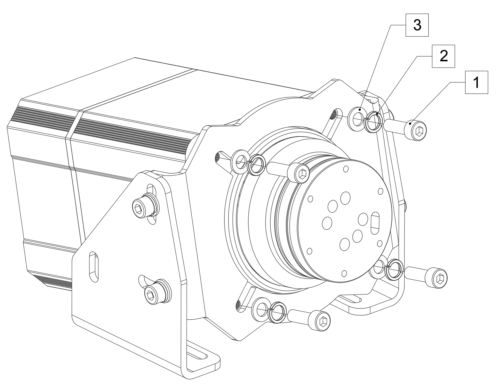

Figure 3. Mounting VNM Wheelbase using a mounting bracket

+-----------------------------------+---------------------------------------------------------------------------------------------------------------------------------------------------+
| Wheelbase Xtreme                  | is mounted with 4xM8 bolts length 30mm with 1,25mm thread pitch (1); 4xM8 spring washers (2); 4xM8 flat washers (3) and 4xM8 nuts (4) in Figure 2 |
+:=================================:+:=================================================================================================================================================:+
| Wheelbase Premier, Elite, Supreme | are mounted with 4xM8 bolts length 25mm with 1,25mm thread pitch (1); 4xM8 spring washers (2) and 4 xM8 flat washers (3) in Figure 3.             |
+===================================+===================================================================================================================================================+

## 2.2. Side mounting pattern
Only The wheelbase Premier, Elite, Supreme have side mounting pattern

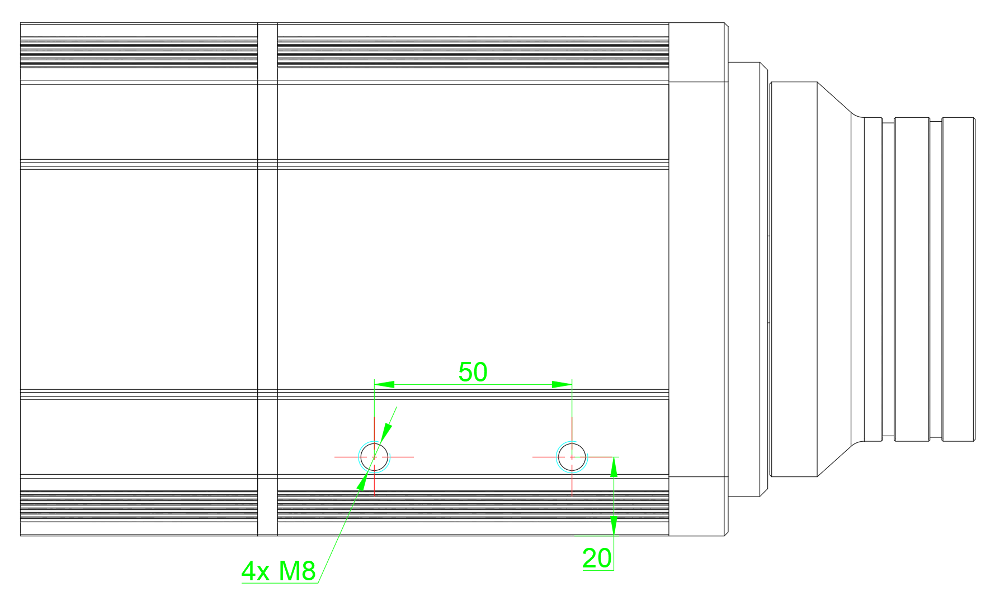

Figure 4. VNM Wheelbase Premier, Elite, Supreme side mounting pattern

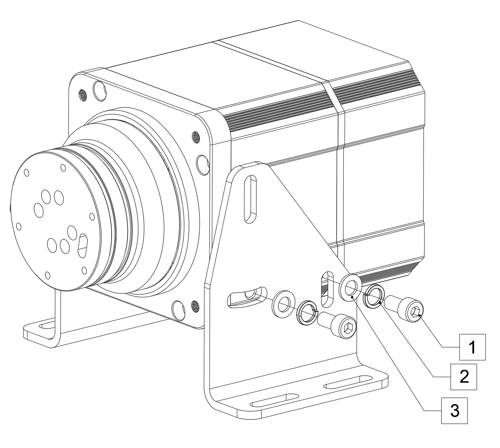

Figure 5. Mount VNM Wheelbase Premier, Elite, Supreme with side mount bracket.

Wheelbase Premier, Elite. Supreme are mounted with 4xM8 bolts length 20mm with 1,25mm thread pitch (1);4xM8 spring washers (2) and 4xM8 flat washers (3).

## 2.3. Bottom mounting pattern
Only The wheelbase Premier, Elite, Supreme have bottom mounting pattern

**2.3.1. The Wheelbase Premier**

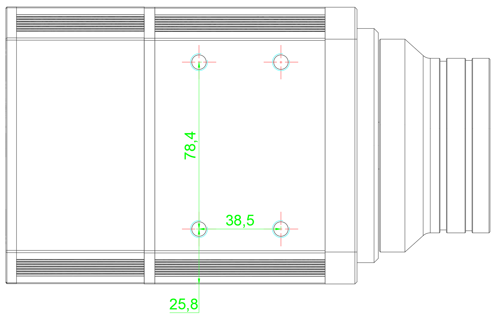

Figure 6. VNM Wheelbase Premier mounting pattern.

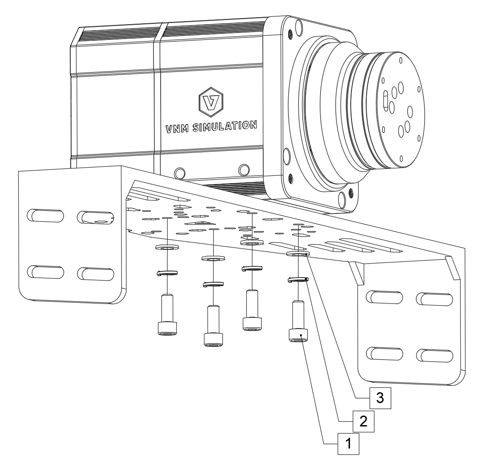

Figure 7. Mounting VNM Wheelbase Premier on bottom mounting bracket.

Wheelbase Premier is mounted with 4 x M8 bolts length 20mm with 1,25mm thread pitch (1); 4 x M8 spring washers (2) and 4 x M8 flat washers (3).

**2.3.2. The Wheelbase Elite**

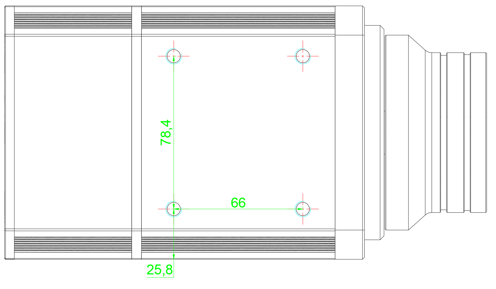

Figure 8. VNM Wheelbase Elite bottom mounting pattern.

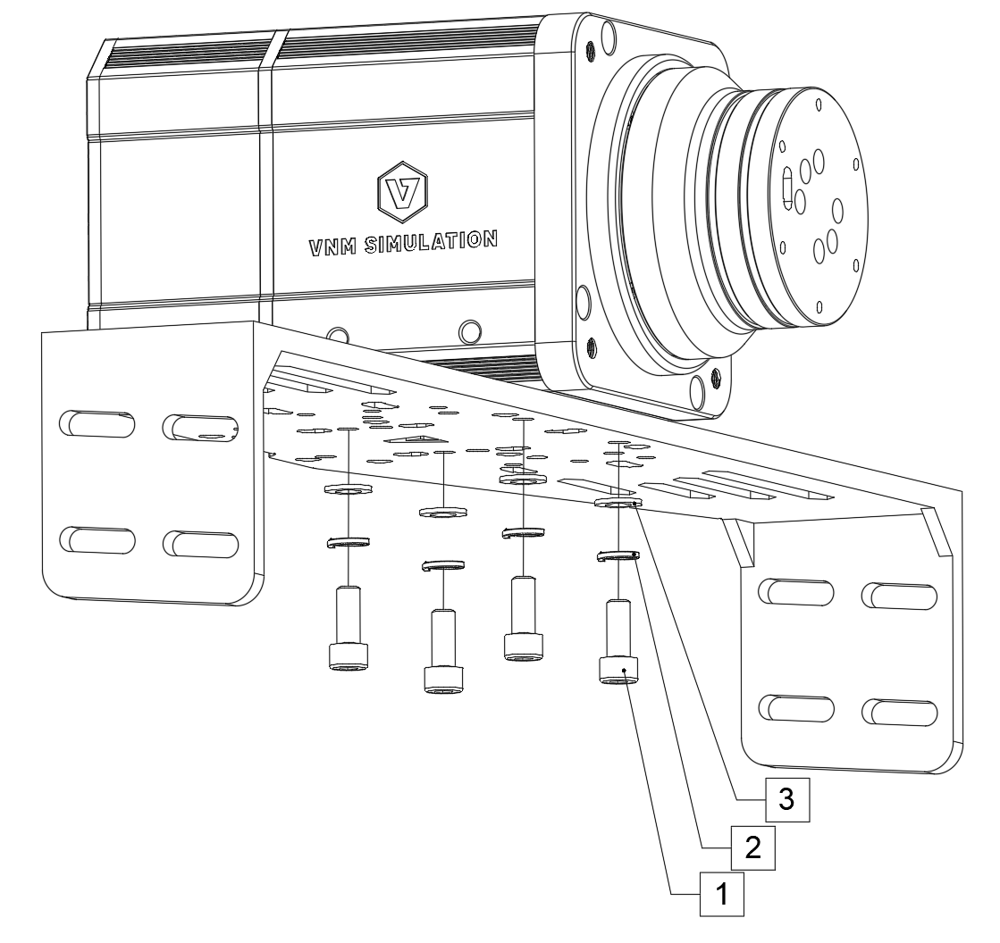

Figure 9. Mounting VNM Wheelbase Elite on bottom mounting bracket.

Wheelbase Elite is mounted with 4xM8 bolts length 20mm with 1,25mm thread pitch (1); 4xM8 spring washers (2) and 4xM8 flat washers (3).

**2.3.3. The Wheelbase Supreme**

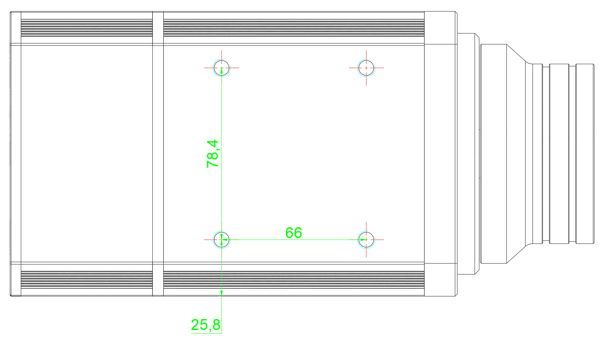

Figure 10. VNM Wheelbase Supreme bottom dimensions

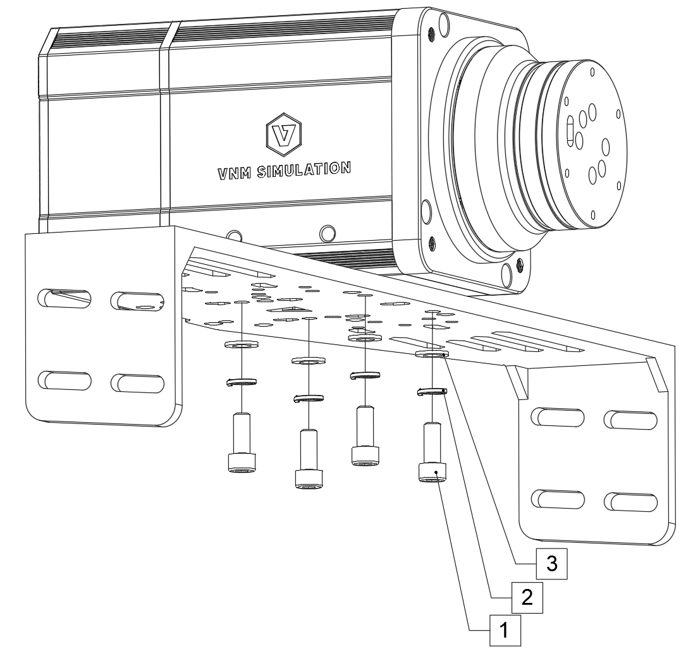

Figure 11. Mounting VNM Wheelbase Supreme on bottom mounting bracket.

Wheelbase Supreme is mounted with 4xM8 bolts length 20mm with 1,25mm thread pitch (1);4xM8 spring washers (2) and 4xM8 flat washers (3).
