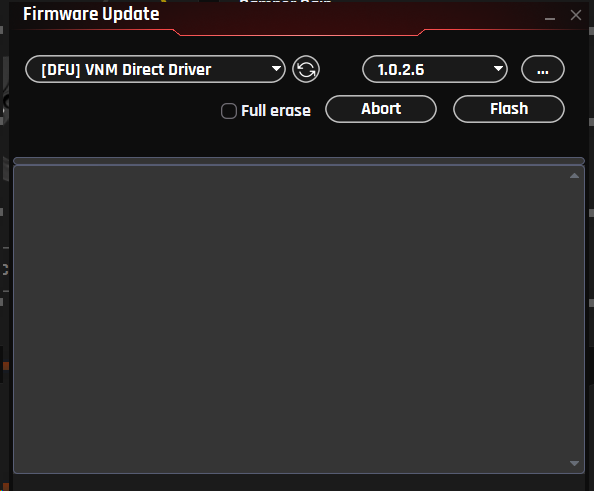

# Firmware Update

## 8.1. Purpose & Importance Notes

Firmware Update allows you to update the internal software of the wheelbase to:

- Improve performance and stability

- Fix bugs

- Add new features

**When to Update**

You should update the firmware when a new version is released by the manufacturer

**Important Notes**

- Update via UI is only available for firmware version 1.0.2.6 or later
  → For lower versions:

  - Hold the reset button for a few seconds

  - Use VNM Flash tool to perform the upgrade

- Do not power off during the update
  → This may corrupt the firmware

- After updating:

  - You may need to Reconnect the device

  - Verify your profiles and settings

- If the update fails:

  - Try again

  - Or use Reconnect (Ctrl + F6)

**How to Access**

Step 1**+** Open VNM SimCenter

Step 2**+** From the top menu, select:**+** Device → Update Firmware

Firmware update panel will be displayed and detect \[DFU\] VNM Direct Driver.

## 8.2. Firmware Update Panel

**Components Description**

**Device (DFU Mode)**

Purpose:
Select the device in DFU (Device Firmware Update) mode

Explanation:

- Example: \[DFU\] VNM Direct Driver

- This indicates the wheelbase is ready for firmware flashing

**Firmware Version**

Purpose:
Select the firmware version to install

Explanation:

- Displays available firmware and the lastest version is chosen (e.g., 1.0.2.6)

- You can change version if multiple options are available

**Refresh Button**

Purpose: Rescan and refresh connected DFU devices

Use case:

- Device not detected

- Just entered DFU mode

**File Selection (...)**

Purpose: Manually select firmware file

Use case: Beta firmware

**Full erase**

Purpose:
Erase all existing firmware before flashing

Explanation:

- Ensures a clean installation

- May take longer

Recommended:

- Use when:

  - Firmware is corrupted

  - Update fails multiple times

**Flash**

Purpose:
Start the firmware update process

**Abort**

Purpose:
Cancel the update process

**Log Window**

Purpose:
Displays update progress and status

Explanation:

- Shows flashing steps

- Displays errors if any

## 8.3. Firmware Update Procedure (DFU Mode)

**Step 1**
Put the wheelbase into DFU mode
(automatic via UI or using reset button if required)

**Step 2**
Open Firmware Update window

**Step 3**
Select:

- DFU device

- Firmware version

**Step 4 (Optional)**
Enable Full erase if needed

**Step 5 +** Click Flash

**Step 6**
Wait until the process completes
(Check log window for status)

## 8.4. Troubleshooting

**Problem: Device not detected after update**
Solution:

- Reconnect the device

- Unplug and reconnect USB

- Restart SimCenter

**Problem: Update stuck or not completing +** Solution:

- Do not power off immediately

- Wait a few more minutes

- If still stuck → restart the software and try again

Notes

- If no DFU device appears:

  - Press Refresh

  - Reconnect USB

  - Enter DFU mode again

- Do not disconnect during flashing

- After successful update:

  - Device will reboot

  - Reconnect may be required
