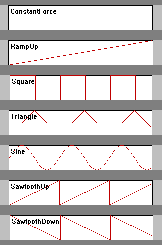

# Game Settings

## 4.1. DirectInput Force Feedback Effects

The parameters in the Game Settings tab correspond to the different Force Feedback effect types defined by the Microsoft DirectInput Force Feedback API.

When a sim racing game sends Force Feedback signals to the wheelbase, those signals are represented using standardized effect types. Each effect type describes how the force behaves over time or how it reacts to steering movement.

VNM SimCenter allows users to adjust the gain (strength) of each effect type. This makes it possible to fine-tune how strongly the wheelbase reproduces specific DirectInput force effects generated by the game.

In most cases, it is recommended to keep all values at 100% to ensure accurate reproduction of the Force Feedback signal from the game.

DirectInput defines several categories of force effects, described below.

Here are some waveforms to understand how each effect works

**4.1.1. Constant Force**

Constant Force represents a steady force that does not change over time.

This type of effect is commonly used by sim racing games to represent continuous steering forces generated by the vehicle physics engine, such as:

- cornering forces from tire grip

- self-aligning torque of the steering system

- sustained steering resistance

For most modern sim racing games, Constant Force is the primary component of the Force Feedback signal.

**4.1.2. Ramp Force**

Ramp Force represents a force that gradually increases or decreases over time.

This type of effect may be used by some games to simulate smooth transitions in steering force, for example when steering load progressively increases as the car enters a corner.

Ramp forces are less commonly used than constant forces in modern physics-based simulators.

**4.1.3. Condition Effects**

Condition effects simulate mechanical characteristics of a steering system.
Unlike constant or ramp forces, condition effects generate forces dynamically based on the movement of the steering wheel.

These effects may depend on parameters such as:

- wheel position

- steering velocity

- steering acceleration

DirectInput defines several types of condition effects.

**Spring**

The Spring effect applies a centering force that pulls the steering wheel toward the neutral position.

Some games use spring forces to simulate the natural centering behavior of a steering system.

In modern physics-based racing simulators, spring forces are often unnecessary because the self-aligning torque of the tires is already calculated by the physics engine.

**Damper**

The Damper effect generates resistance proportional to the speed of the steering movement.

This effect simulates damping in the steering system and helps stabilize steering motion.

Increasing damper gain increases resistance when the wheel is turned quickly.

**Friction**

The Friction effect applies a constant resistance to steering movement regardless of steering speed.

This effect may be used to simulate mechanical friction within the steering system.

**Inertia**

The Inertia effect simulates the rotational mass of the steering system.

This effect causes the wheel to resist changes in rotational acceleration, similar to the behavior of a physical steering assembly.

**4.1.3. Periodic Effects**

Periodic effects generate oscillating forces based on mathematical waveforms.

These effects are commonly used to simulate vibration or repeating force patterns.

DirectInput defines several waveform types.

**Sine Wave**

A sine wave produces a smooth and continuous oscillating force.

This effect may be used to simulate road surface vibration or other periodic oscillation effects.

**Triangle Wave**

A triangle wave generates a force that changes linearly between two values over time.

Some games may use triangle waves for vibration effects or testing signals.

**Square Wave**

A square wave alternates abruptly between two force levels.

This waveform can create strong vibration effects or distinct feedback patterns.

Sawtooth Wave

A sawtooth waveform gradually increases or decreases before changing abruptly.

DirectInput defines two variants:

- Sawtooth Up -- the force gradually increases and then suddenly drops

- Sawtooth Down -- the force gradually decreases and then suddenly rises

These waveforms may be used by certain games to generate specific vibration patterns.

## 4.2. Recommended Usage

In most cases, users should keep all DirectInput effect gain values at 100%.

This ensures that the wheelbase reproduces the Force Feedback signal generated by the game as accurately as possible.

Adjust these values only if you want to modify how strongly the wheelbase responds to a specific type of DirectInput force effect.

## 4.3. Some game and effects

These are the games and its effects. Users can adjust the gain to meet personal liking

+-------------------------+-------------------------------------------------------------+-----------------------+
| Game                    | Game effect                                                 | User Effect           |
+:========================+:============================================================+:======================+
| AC/ACC/iRacing/ F1 2020 | Constant gain, damper gain                                  | All                   |
+-------------------------+-------------------------------------------------------------+-----------------------+
| AMS2                    | Constant gain                                               | All                   |
+-------------------------+-------------------------------------------------------------+-----------------------+
| Dirt4/Rally 2.0         | Constant gain, friction gain                                | All                   |
+-------------------------+-------------------------------------------------------------+-----------------------+
| Project car 2           | Constant gain, sine gain                                    | All                   |
+-------------------------+-------------------------------------------------------------+-----------------------+
| Raceroom                | Sine gain                                                   | All                   |
+-------------------------+-------------------------------------------------------------+-----------------------+
| RF 2                    | Sine gain, damper gain                                      | All                   |
+-------------------------+-------------------------------------------------------------+-----------------------+
| WRC Generation          | Ramp gain, square gain, sine gain, spring gain, damper gain | All                   |
+-------------------------+-------------------------------------------------------------+-----------------------+
| WRC 10                  | Constant gain, sine gain, spring gain, damper gain          | All                   |
+=========================+=============================================================+=======================+
| To be updated           |                                                             |                       |
+=========================+=============================================================+=======================+
