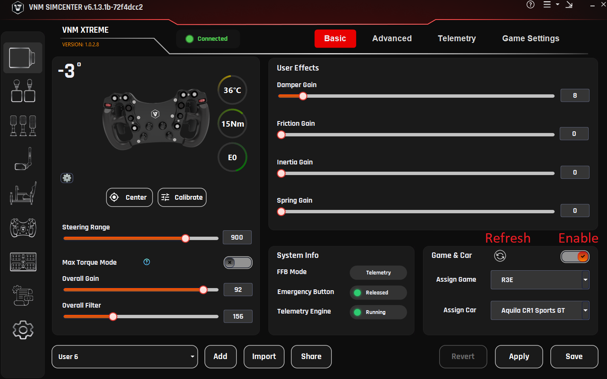
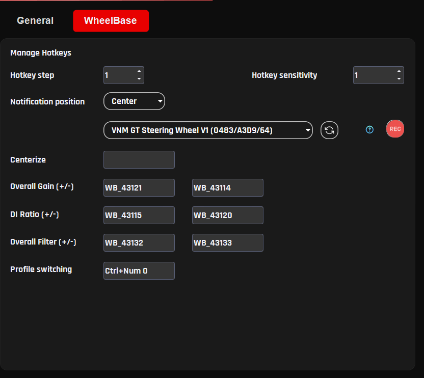

# Wheelbase Profiles

Wheelbase Profiles allow users to save, load, and manage different wheelbase configurations.

A profile stores all current wheelbase settings, including parameters from the Basic, Advanced, and Game Settings tabs. This allows users to quickly switch between different configurations depending on the sim racing game, vehicle type, or personal driving preference.

Using profiles makes it easy to maintain separate setups for different racing scenarios, such as:

different sim racing games

different car types (Formula, GT, Rally, etc.)

different steering wheels

different Force Feedback preferences

Profiles can also be shared between users or backed up for later use.

## 5.1 Profile Management

The profile management controls are located in the Profile section of the wheelbase configuration page.

Users can perform the following actions:

create new profiles

load existing profiles

save changes to the current profile

import profiles from external files

share profiles with other users

## 5.2. Creating a New Profile

To create a new wheelbase profile:

Step 1
Click Add Profile.

Step 2
Enter a name for the new profile.

Step 3
Adjust the wheelbase settings as desired.

Step 4
Click Save to store the profile.

The new profile will now appear in the profile list.

## 5.3. Loading a Profile

To switch to a different profile:

Step 1
Open the Profile list.

Step 2
Select the desired profile.

Step 3
Click Apply.

The wheelbase will immediately load the settings stored in that profile.

## 5.4. Saving Profile Changes

If you modify any wheelbase settings, the profile can be updated to store the new configuration.

Step 1
Adjust the desired parameters.

Step 2
Click Save to store the changes in the current profile.

If the changes should not be saved, click Revert to restore the previous settings.

## 5.5. Importing Profiles

Profiles can be imported from external files.

Step 1
Click Import.

Step 2
Select the profile file.

Step 3
The profile will be added to the profile list.

This feature allows users to load profiles shared by other users or provided by VNM.

## 5.6. Sharing Profiles

Profiles can also be exported and shared with other users.

Sharing profiles is useful when:

exchanging Force Feedback setups with other sim racers

distributing recommended settings for specific games

backing up personal configurations

Recommended Usage

It is recommended to create separate profiles for each sim racing game.

Different games use different Force Feedback models, and separate profiles help maintain consistent steering behavior across titles.

## 5.7. Automatically Change Profile

**Purpose**

The Automatically Change Profile feature automatically switches the wheelbase profile based on the car you are using in-game.
This eliminates the need for manual profile changes and ensures optimal Force Feedback for each vehicle.

**Requirements**

- VNM Telemetry Plugin version \>= 0.0.107

- Applies to wheelbase profiles only

- Not yet supported for Telemetry profiles

**How It Works**

- The plugin automatically detects the game + car when selected in-game

- Each car can be assigned to a dedicated profile

- When you return to that car → the profile is automatically loaded

**Important Note:**

- If no profile is assigned to a car:
  → the system will use the current active profile

**Setup (for new car)**

When using a new car (not yet learned by the plugin), follow these steps:

**Step 1**
Open VNM SimCenter

**Step 2**
Navigate to Automatically Change Profile

**Step 3**
Enable the Automatically Change Profile feature

**Step 4**
Click Refresh to update the car list from the plugin

**Step 5**
Select game and car from the drop lists

**Step 6**
Configure Force Feedback settings as desired (Overall gain, user effects..)

**Step 7**
Click Save

**What Happens Next**

- When you select the same car again:

  - The saved profile will be automatically loaded

- When switching to another car:

  - The corresponding profile will be loaded (if available)

**Notes**

- If the car does not appear:

  - Click Refresh

- If the profile does not load automatically:

  - Ensure the plugin is running

  - Check plugin version (\>= 0.0.107)

  - Make sure the feature is enabled

**Best Practices**

- Create separate profiles for different car types:

  - GT3

  - Formula

  - Drift

- Avoid using a single profile for all cars

- Always click **Save** after making changes

- Use clear profile names
  (e.g., ACC_GT3_Ferrari_296)

## 5.8. Hotkey to Change wheelbase settings and profile

**Purpose**

This section allows you to quickly adjust wheelbase settings and switch profiles without going to Windows.

**Access**

Step 1
Open VNM SimCenter

Step 2
Go to:
Settings → Wheelbase

**Hotkey Configuration**

**Hotkey step**

Purpose:
Defines how much the value changes with each key press

Explanation:
Each press will increase/decrease the value based on this step

Recommended:

- 1--5 (depending on how fine you want the adjustment)

**Hotkey sensitivity**

Purpose:
Controls how fast values change when holding a key

Explanation:
Higher value → slower change when holding the key

**Notification position**

Purpose:
Defines where notifications appear on screen

Options:

- Center

- (Other positions depending on version)

**Device selection**

Purpose:
Select which device receives the hotkey input

Explanation:
Dropdown shows the currently controlled device

Example:

- VNM GT Steering Wheel V1

**Hotkey Mapping**

You can assign keys to control functions directly.

**How to assign keys (important)**

**For Overall Gain, DI Ratio, Overall Filter:**

Step 1
Click the REC button

Step 2
Press the key you want to assign

Step 3
The key will be saved to that function

**For Centerize and Profile switching:**

Step 1
Click on the input field

Step 2
Press the key or key combination you want to assign

**Centerize**

Purpose:
Return the wheel to center position (0°)

**Overall Gain (+ / -)**

Purpose:
Increase / decrease overall FFB strength

Use case:

- Reduce force if it feels too heavy

- Increase force if feedback is too weak

**DI Ratio (+ / -)**

Purpose:
Adjust DirectInput scaling ratio in TIC mode

Explanation:
Affects how force from the game is scaled

**Overall Filter (+ / -)**

Purpose:
Adjust FFB smoothness

Explanation:

- Higher → smoother, less noise

- Lower → more detail, but may feel rough

Profile switching

Purpose:
Quickly switch between profiles

Example:

- Ctrl + Num 0

Click Save in the bottom-right corner to apply all changes

## 5.9. General Settings

This section controls how the wheelbase is displayed and how certain UI-related behaviors function. These settings do not directly affect Force Feedback, but help with monitoring and usability.

**Wheel max angle**

Purpose:
Defines the maximum steering angle displayed in the software

Explanation:
This value is used for UI visualization and wheel animation, not the physical steering limit of the wheelbase

Recommended:

- 1080° for most road and GT cars

**Wheel angle step**

Purpose:
Defines how much the steering angle changes when adjusted via hotkeys

Explanation:
Each hotkey press will increase or decrease the wheel angle by this value using the arrow keys (after clicking on the slider handle).

Recommended:

- 90° or 180° for quick adjustments

**Show current torque in percentage**

Purpose:
Displays current Force Feedback output as a percentage

Explanation:
Shows torque as a percentage instead of Nm, making it easier to monitor overall usage and detect limits

**Enable circle animation**

**Purpose:**
Displays a circular visualization for base status

Explanation:
Provides a visual indicator for:

- Base temperature

- Torque output

- Error status
