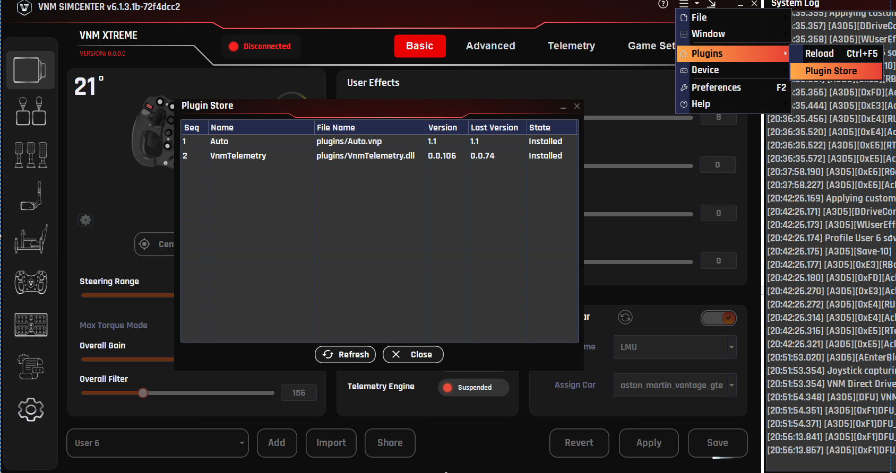
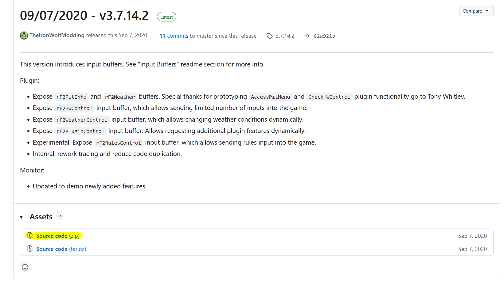
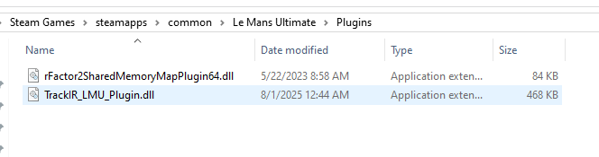
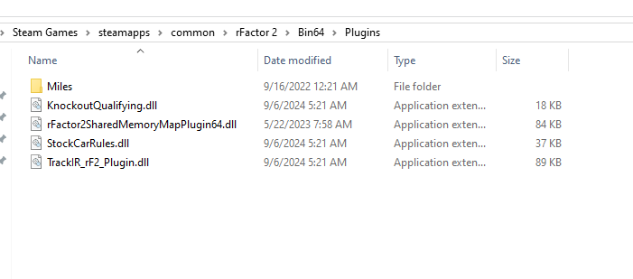

# Telemetry

The Telemetry tab allows the wheelbase to generate additional Force Feedback based on vehicle telemetry data received from supported sim racing games.

Unlike standard DirectInput Force Feedback, which is transmitted directly from the game, Telemetry-based feedback is calculated by the VNM telemetry engine using real-time vehicle data received from supported games.

Depending on the selected FFB Mode, telemetry data may either:

- supplement the Force Feedback generated by the game, or

- generate Force Feedback directly from vehicle telemetry data.

Telemetry-based feedback can reproduce additional driving cues such as:

- gear shifts

- wheel slip

- road surface detail

- ABS activity

These effects help provide additional vehicle feedback and enhance the overall driving experience.

## 6.1. Telemetry Force Distribution

Telemetry Force Feedback in VNM SimCenter consists of two components:

- Telemetry Core Force

- Telemetry Effects

Telemetry Core Forces represent the continuous forces generated from vehicle telemetry data, such as steering load or vehicle dynamics.

Telemetry Effects are short-duration signals generated from specific vehicle events, for example:

- gear shifts

- ABS activation

- wheel spin

- road texture events

To ensure that event-based effects remain clearly perceptible without overwhelming the main steering forces, VNM SimCenter automatically manages the distribution of force output between these two components.

Force Allocation Behavior

When no telemetry effects are enabled

Telemetry Core Forces = 100%
Telemetry Effects = 0%

The wheelbase reproduces the full telemetry-based force feedback signal.

When one or more telemetry effects are enabled. A portion of the available torque output is reserved for telemetry effects so that event-based feedback remains clearly perceptible

By default, approximately 70% of the force output is allocated to telemetry forces and 30% to telemetry effects.

This automatic distribution helps maintain a balance between:

- continuous steering forces

- short event-based feedback signals

Recommended Usage

Telemetry effects are designed to complement the main steering forces generated from telemetry data.

Enabling too many telemetry effects simultaneously may too much information (could cause noise) of the continuous telemetry force.

For the best driving experience, enable only the effects that provide user liking meaningful feedback for the selected sim racing game.

## 6.2. Telemetry Plugin

Telemetry data is provided through a plugin system.

The plugin receives telemetry data from supported games and sends it to VNM SimCenter, where the data is processed to generate additional Force Feedback effects.

The plugin system supports two types of plugins:

Native Plugins

Native plugins are distributed as DLL files and are loaded directly by VNM SimCenter.

Python Plugins (deprecated)

Python plugins consist of two files:

- a .vnp file describing the plugin

- a .vne file containing the execution logic

These plugins allow users or developers to create custom telemetry processing logic.

Python plugins are deprecated and may be removed in future versions of VNM SimCenter.

## 6.3. Installing Telemetry Plugins

Plugins can be installed using the Plugin Store or by manually copying plugin files into the plugins folder.

To install a plugin:

Step 1
Open the Plugin Store.

Step 2
Select the desired plugin.

Step 3
Click Install.

Step 4

Reload plugin after installing a new plugin to ensure it is properly loaded

Alternatively, plugin files can be manually copied into the plugins directory located in the same folder as the VNM SimCenter application.

## 6.4. Telemetry Effect Parameters

Each telemetry effect can be configured using several parameters that control how the effect is generated.

Typical configuration parameters include the following.

Enable

Enables or disables the selected telemetry effect.

If disabled, the effect will not be generated even if the telemetry event occurs.

Waveform

Defines the waveform used to generate the vibration or force signal.

Available waveform types include:

- Sine

- Triangle

- Square

- Sawtooth

- Constant

Different waveforms produce different vibration characteristics.

Gain

Controls the overall gain applied to the effect signal.

Increasing this value increases the amplitude of the generated force.

Frequency

Defines the oscillation frequency of the generated signal.

Higher frequency values produce faster vibration patterns.

Duration

Defines how long the effect lasts after the telemetry event is triggered.

This parameter is typically used for short events such as gear shifts.

A value of -1 disables the duration limit

## 6.5. Telemetry Tab Settings

**6.5.1. Gear Shift**

**Purpose**

The **Gear Shift effect** generates a short vibration or force pulse when the vehicle changes gear.

This effect simulates the mechanical sensation that occurs during a gear shift, helping the driver perceive gear changes more clearly through the steering wheel.

Gear shift feedback can be especially useful in vehicles with sequential gearboxes or paddle shifters, where the driver may rely on tactile feedback rather than visual cues.

**Explanation**

When a gear change event is detected from telemetry data, VNM SimCenter generates a short force signal based on the selected waveform and parameters.

The strength and character of the effect can be adjusted using several parameters, allowing users to customize how the gear shift feedback feels.

The generated signal is mixed with the telemetry core force output according to the Telemetry Force Distribution described earlier.

**Parameters**

**Enable**

Enables or disables the Gear Shift telemetry effect.

When disabled, no gear shift feedback will be generated.

**Waveform**

Defines the waveform used to generate the vibration signal.

Available waveform types may include:

- Sine

- Triangle

- Square

- Sawtooth

Different waveforms produce different vibration characteristics.

For example:

- Sine produces a smooth vibration

- Square produces a stronger and sharper pulse

**Gain**

Controls the overall amplitude of the gear shift signal.

Higher gain values produce stronger gear shift feedback.

**Frequency**

Defines the oscillation frequency of the vibration signal.

Higher frequencies produce faster vibration patterns, while lower frequencies create slower pulses.

Typical gear shift effects use relatively high frequencies to simulate a short mechanical impact.

**Duration**

Defines how long the gear shift effect lasts after the shift event is detected.

Short durations create a quick mechanical \"kick\", while longer durations produce a more sustained vibration.

Typical values are 10--40 ms depending on user preference.

**Recommended Usage**

For realistic gear shift feedback:

- Use short duration values

- Use medium to high frequencies

- Avoid excessive gain that may mask other Force Feedback signals

Gear shift feedback should remain subtle and should not overpower the primary steering forces.

**6.5.2 EngineVibe**

**Purpose**
The Engine Vibration effect generates continuous vibration based on the engine speed (RPM) of the vehicle.

This effect simulates the vibration produced by the engine and drivetrain, providing additional feedback about engine operation and RPM levels through the steering wheel.

Engine vibration can help drivers perceive engine load and speed without relying solely on visual indicators.

**Explanation**
When telemetry data reports the current engine RPM, VNM SimCenter generates a vibration signal based on the configured parameters.

The vibration characteristics vary with engine speed:

- As RPM increases, the vibration frequency increases to reflect faster engine operation

- The vibration strength also increases slightly with RPM to enhance perceptibility

The final vibration frequency is limited within a defined range to prevent excessive vibration and to avoid masking important Force Feedback details such as tire grip and road surface information.

This ensures that engine vibration provides useful feedback while remaining subtle and non-intrusive.

**Parameters**

**Enable**

Enables or disables the Engine Vibration telemetry effect.

When disabled, no engine vibration feedback will be generated.

**Waveform**

Defines the waveform used to generate the vibration signal.

Available waveform types may include:

- Sine

- Triangle

- Square

- Sawtooth

A sine waveform is typically recommended for engine vibration because it produces smooth oscillations.

**Gain**

Controls the overall amplitude of the engine vibration signal.

Higher gain values produce stronger vibration.

**Frequency**

Defines the base oscillation frequency of the vibration signal.

This value acts as the base frequency, which is dynamically adjusted according to engine RPM.

Higher values produce faster vibration patterns, while lower values result in slower oscillations.

**Recommended Usage**

Engine vibration should remain subtle so that it does not interfere with the main steering forces.

For most vehicles:

- Use moderate gain values
- Use smooth waveforms such as **Sine**
- Avoid excessive vibration strength

This ensures that engine vibration provides additional feedback without masking the core Force Feedback signal.

**Example Settings**

Example baseline configuration:

Waveform : Sine
Gain : 20 -- 40
Frequency : 40 -- 80 Hz

These values produce a subtle vibration that varies with engine speed while maintaining clear steering feedback.

**6.5.3. RoadTexture**

**Purpose**

The Road Texture effect generates subtle vibrations based on road surface telemetry data.

This effect simulates small surface irregularities of the track, allowing the driver to feel the texture of the road through the steering wheel.

Road Texture helps improve immersion by providing additional tactile feedback from the driving surface.

**Explanation**

When telemetry data indicates variations in the road surface or tire contact forces, VNM SimCenter generates a vibration signal that reflects the texture of the track.

Unlike large steering forces generated by vehicle dynamics, road texture feedback consists of small high-frequency vibrations designed to reproduce the fine details of the road surface.

The resulting signal is mixed with the telemetry core force output according to the Telemetry Force Distribution described earlier.

**Parameters**

**Enable**

Enables or disables the Road Texture telemetry effect.

When disabled, no road surface vibration will be generated.

**Waveform**

Road texture is generated from real-time telemetry data. Therefore this effect typically uses a constant force signal rather than a predefined waveform.

**Gain**

Controls the overall amplitude of the road texture signal.

Higher values increase the strength of road surface vibrations.

Excessive gain may produce unrealistic steering vibration.

**Recommended Usage**

Road texture effects should remain subtle and should not overpower the primary Force Feedback generated by the vehicle physics.

For realistic results:

- use moderate gain values

- use medium to high frequencies

- avoid excessive vibration strength

Too much road texture feedback may mask important steering forces such as tire grip or weight transfer.

**6.5.4. ABS**

**Purpose**

The ABS effect generates vibration feedback when the vehicle's Anti-lock Braking System (ABS) is activated.

This effect helps the driver detect when the braking system is approaching the traction limit and the ABS system begins to modulate brake pressure.

Providing tactile feedback for ABS activation can help drivers better control braking force during heavy braking situations.

**Explanation**

When telemetry data indicates that the ABS system is active, VNM SimCenter generates a vibration signal through the wheelbase.

The vibration typically consists of rapid pulses that simulate the sensation of brake modulation occurring during ABS operation.

This feedback helps inform the driver that the wheels are near the limit of grip and that braking pressure may need to be adjusted.

The generated signal is mixed with the telemetry force output according to the Telemetry Force Distribution described earlier.

**Parameters**

**Enable**

Enables or disables the ABS telemetry effect.

When disabled, no ABS vibration feedback will be generated.

**Waveform**

Defines the waveform used to generate the ABS vibration signal.

Available waveform types may include:

- Sine

- Triangle

- Square

- Sawtooth

For ABS simulation, Sine or Triangle waveforms often provide clearer pulse feedback.

**Gain**

Controls the overall amplitude of the ABS vibration signal.

Higher values produce stronger vibration when ABS activates.

**Frequency**

Defines the oscillation frequency of the vibration signal.

Short durations are typically recommended to simulate rapid brake pressure modulation.

**Brake Input ABS Trigger**

**Purpose**

Defines the brake pedal input level required before the ABS vibration effect can be activated.

**Explanation**

Brake Input ABS Trigger acts as a minimum brake pedal threshold.
The ABS telemetry effect will only be allowed to activate when the brake pedal input exceeds this value.

This prevents the ABS vibration from being triggered during light braking situations where ABS is unlikely to occur.

For example, if Brake Input ABS Trigger is set to 5000, the ABS vibration effect will only activate when the brake pedal input exceeds this threshold and an ABS event is detected.

Using a brake input threshold helps ensure that ABS feedback is generated only during heavy braking conditions where the Anti-lock Braking System is likely to engage.

**Recommended Usage**

Use a moderate threshold value to avoid unnecessary vibration during normal braking.

Higher values require stronger brake input before the ABS effect can activate.
Lower values allow ABS feedback to trigger earlier.

**ABS Trigger**

**Purpose**

Defines the telemetry threshold used to detect ABS activity.

**Explanation**

ABS Trigger determines the sensitivity of the ABS telemetry signal required to activate the ABS vibration effect.

When the telemetry data indicates that the ABS system is active and exceeds the configured ABS Trigger level, the wheelbase generates the configured ABS vibration signal.

Lower values make the ABS effect more sensitive and allow it to trigger more easily.
Higher values require stronger ABS activity before the vibration effect is generated.

This parameter allows users to adjust how early or aggressively the ABS feedback is felt through the steering wheel.

**Recommended Usage**

Lower values produce earlier ABS feedback and may generate more frequent vibration.

Higher values reduce sensitivity and ensure that ABS vibration is generated only during strong ABS activation.

Users should adjust this value according to the behavior of the specific racing simulator and vehicle.

Note: Only iRacing uses ABS flag to generate ABS signal, other games use other telemetries to calculate.

**6.5.5. Brake Lock Up**

**Purpose**

The Brake Lockup effect generates vibration feedback when one or more wheels begin to lock during braking.

This effect helps the driver detect loss of tire rotation caused by excessive braking force.
Feeling this feedback through the steering wheel allows the driver to reduce brake pressure and regain traction more quickly.

Brake lockup feedback is especially useful in racing simulators where vehicles may not use ABS or when ABS is disabled.

**Explanation**

When telemetry data indicates that a wheel has stopped rotating relative to the vehicle speed (wheel lock condition), VNM SimCenter generates a vibration signal through the wheelbase.

This vibration simulates the harsh mechanical sensation associated with a tire sliding on the track surface during heavy braking.

The generated signal is mixed with the telemetry force output according to the Telemetry Force Distribution described earlier.

Brake Lockup feedback typically appears as a short, sharp vibration that alerts the driver that the braking force has exceeded the available tire grip.

**Parameters**

**Enable**

Enables or disables the Brake Lockup telemetry effect.

When disabled, no vibration feedback will be generated during wheel lock events.

**Waveform**

Defines the waveform used to generate the vibration signal.

Available waveform types may include:

- Sine
- Triangle
- Square
- Sawtooth

Square or Triangle waveforms are typically recommended for Brake Lockup feedback because they produce sharper pulses that are easier to perceive.

**Frequency**

Defines the oscillation frequency of the vibration signal.

Higher frequencies produce faster vibration pulses, while lower frequencies generate slower feedback patterns.

Typical lockup feedback uses medium to high frequencies to simulate tire sliding vibration.

**Brake Input BLU Trigger**

Defines the minimum brake pedal input required before the Brake Lockup effect can activate.

This prevents the effect from triggering during light braking situations.

Higher values require stronger brake pedal input before lockup feedback is allowed.

**BLU Trigger**

Defines the telemetry threshold used to detect a wheel lock condition.

Lower values make the effect more sensitive and allow earlier detection of wheel lock.

Higher values require more severe wheel lock conditions before the vibration effect is triggered.

**Recommended Usage**

Brake Lockup feedback should remain noticeable but not overpower the primary steering forces.

For realistic results:

- Use moderate strength values
- Use medium to high frequencies
- Avoid excessive gain that may mask tire grip feedback

This effect is particularly useful in racing games where precise brake modulation is required to prevent wheel lock.

**6.5.6. Wheel Spin**

**Purpose**

The Wheel Spin effect generates vibration feedback when the driven wheels begin to spin faster than the available tire grip during acceleration.

This effect helps the driver detect loss of traction caused by excessive throttle input. Feeling this feedback through the steering wheel allows the driver to reduce throttle and regain traction more effectively.

Wheel spin feedback is especially useful in high-power vehicles where throttle control is critical.

**Explanation**

When telemetry data indicates that the driven wheels are rotating faster than the vehicle speed (wheel slip condition), VNM SimCenter generates a vibration signal through the wheelbase.

This vibration simulates the sensation of tire slip that occurs when traction is lost under acceleration.

The generated signal is mixed with the telemetry force output according to the Telemetry Force Distribution described earlier.

Wheel spin feedback typically appears as a vibration that increases when throttle input exceeds the available grip.

**Parameters**

**Enable**

Enables or disables the Wheel Spin telemetry effect.

When disabled, no vibration feedback will be generated during wheel spin events.

**Waveform**

Defines the waveform used to generate the vibration signal.

Available waveform types may include:

- Sine
- Triangle
- Square
- Sawtooth

Sine waveforms are commonly used for wheel spin feedback because they produce smooth vibration patterns.

**Strength**

Controls the intensity of the vibration generated during a wheel spin event.

Higher values produce stronger feedback.

Excessive values may interfere with the main steering forces.

**Frequency**

Defines the oscillation frequency of the vibration signal.

Higher frequency values produce faster vibration patterns, while lower values generate slower oscillations.

Wheel spin feedback typically uses medium to high frequencies to simulate tire slip vibration.

**Throttle Trigger**

Defines the minimum throttle input required before the Wheel Spin effect can activate.

This prevents the effect from triggering during very light throttle input.

Higher values require stronger throttle input before wheel spin feedback is allowed.

**Wheel Spin Trigger**

Defines the telemetry threshold used to detect wheel slip.

Lower values make the effect more sensitive and allow earlier detection of wheel spin.

Higher values require more severe wheel slip before the vibration effect is generated.

**Recommended Usage**

Wheel spin feedback should remain noticeable but not overpower the primary steering forces.

For realistic results:

- Use moderate strength values
- Use medium to high frequencies
- Avoid excessive vibration strength

Proper tuning allows the driver to feel traction loss during acceleration without masking important steering information such as tire grip or vehicle balance.

**6.5.7. Understeer**

**Purpose**

The Understeer effect generates vibration feedback when the front tires begin to lose grip during cornering.

This effect helps the driver detect understeer conditions where the vehicle turns less than expected despite steering input.

Feeling this feedback through the steering wheel allows the driver to adjust steering angle or reduce throttle in order to regain front tire grip.

**Explanation**

When telemetry data indicates that the front tires have exceeded their optimal slip angle and begin to slide, VNM SimCenter generates a vibration signal through the wheelbase.

This feedback represents the reduction in front tire grip that occurs during understeer.

The vibration is designed to alert the driver that the front tires are approaching or exceeding their traction limit.

The generated signal is mixed with the telemetry force output according to the Telemetry Force Distribution described earlier.

Understeer feedback typically appears as a subtle vibration that increases as the front tires lose grip.

**Parameters**

**Enable**

Enables or disables the Understeer telemetry effect.

When disabled, no feedback will be generated when the vehicle experiences understeer.

**Waveform**

Defines the waveform used to generate the vibration signal.

Available waveform types may include:

- Sine
- Triangle
- Square
- Sawtooth

A sine waveform is commonly used because it produces smooth vibration patterns.

**Gain**

Controls how strongly the understeer telemetry signal contributes to the generated vibration.

Higher values increase the sensitivity of the effect to understeer telemetry data.

**Frequency**

Defines the oscillation frequency of the vibration signal.

Lower frequencies produce slower oscillations, while higher frequencies produce faster vibration patterns.

Understeer feedback typically uses lower to medium frequencies so that the vibration remains noticeable but not distracting.

**Understeer Trigger**

Defines the telemetry threshold required before the Understeer effect activates.

Lower values make the effect more sensitive and allow earlier detection of understeer.

Higher values require stronger front tire slip before the vibration is generated.

**Recommended Usage**

Understeer feedback should remain subtle and should not overpower the main steering forces generated by the vehicle physics.

For realistic results:

- Use moderate gain values
- Use low to medium frequencies
- Avoid excessive vibration strength

Proper tuning allows the driver to detect front tire grip loss without masking important steering feedback such as tire load or weight transfer.

**6.5.8. Oversteer**

The Oversteer effect generates vibration feedback when the rear tires begin to lose grip during cornering.

This effect helps the driver detect oversteer conditions where the rear of the vehicle begins to slide outward due to loss of traction.

Feeling this feedback through the steering wheel allows the driver to react quickly by adjusting steering input or throttle to regain rear tire grip and stabilize the vehicle.

When telemetry data indicates that the rear tires exceed their optimal slip angle and begin to slide, VNM SimCenter generates a vibration signal through the wheelbase.

This vibration represents the loss of rear traction that occurs during oversteer.

The feedback is designed to alert the driver that the rear tires are approaching or exceeding their grip limit.

The generated signal is mixed with the telemetry force output according to the Telemetry Force Distribution described earlier.

Oversteer feedback typically appears as a noticeable vibration that increases as the rear tires lose traction.

**Parameters**

**Enable**

Enables or disables the Oversteer telemetry effect.

When disabled, no feedback will be generated when the vehicle experiences oversteer.

**Waveform**

Defines the waveform used to generate the vibration signal.

Available waveform types may include:

- Sine
- Triangle
- Square
- Sawtooth

Square or Triangle waveforms are often used because they produce clearer vibration pulses that are easier to detect during rapid rear traction loss.

**Gain**

Controls how strongly the oversteer telemetry signal contributes to the generated vibration.

Higher values increase the sensitivity of the effect to rear tire slip telemetry data.

**Frequency**

Defines the oscillation frequency of the vibration signal.

Lower frequencies produce slower oscillations, while higher frequencies generate faster vibration patterns.

Oversteer feedback typically uses low to medium frequencies so the vibration remains clearly perceptible during rear traction loss.

**Oversteer Trigger**

Defines the telemetry threshold required before the Oversteer effect activates.

Lower values make the effect more sensitive and allow earlier detection of rear tire slip.

**Recommended Usage**

Higher values require stronger oversteer conditions before the vibration is generated.

Oversteer feedback should remain noticeable but should not overpower the primary steering forces.

For realistic results:

- Use moderate gain values
- Use low to medium frequencies
- Avoid excessive vibration strength

Proper tuning allows the driver to detect rear traction loss early without masking important steering feedback such as tire grip and vehicle balance.

**6.5.9. General**

The General section contains global parameters that affect how telemetry-based force feedback signals are processed before being sent to the wheelbase.

These settings help control the overall behavior of telemetry forces, prevent excessive force spikes, and allow additional steering effects to be applied to telemetry-generated feedback.

**Haptic Only**

**Purpose**

Determines whether telemetry effects are applied only to haptic-style vibration signals.

**Explanation**

When Haptic Only is enabled, telemetry effects generate vibration feedback without modifying the main steering torque produced by the wheelbase.

This mode is useful when telemetry effects are intended to provide additional tactile cues without interfering with the primary steering forces generated by the simulator physics.

When disabled, telemetry effects may also influence the main force feedback signal.

This feature is used to test each effect with its settings.

**Haptic Headroom**

**Purpose**
Reserves a portion of torque for telemetry effects.

**Explanation**
Under high steering load, most torque may be used for steering force, making telemetry effects less noticeable.
Haptic Headroom ensures telemetry feedback remains perceptible.

**Behavior**

- Low → stronger steering, weaker telemetry

- High → clearer telemetry, slightly reduced steering force

**Recommended Usage**
Increase if telemetry effects are too weak. Decrease if steering feels too light.

Default value is 30%

**Force Spike Reduction Enable**

**Purpose**

Enable or disable the limits extremely large force spikes generated by telemetry signals.

**Explanation**

Certain telemetry events can generate very sharp force spikes that may feel unrealistic or uncomfortable.

The Force Spike Reduction feature detects sudden increases in force magnitude and limits them to a safer and smoother level.

This helps maintain a more natural steering feel while protecting the driver from abrupt force changes.

**Force Spike Trigger**

**Purpose**

Defines the threshold at which force spike reduction begins to activate.

**Explanation**

When the magnitude of the telemetry force exceeds this threshold, the system identifies the signal as a potential force spike.

Once this threshold is exceeded, the Force Spike Reduction system begins limiting the force output.

Lower values make the system more sensitive and activate spike reduction earlier.

Higher values allow stronger force peaks before limiting occurs.

**Force Spike Limit**

**Purpose**

Defines the maximum allowed magnitude of telemetry force when spike reduction is active.

**Explanation**

When Force Spike Reduction is triggered, the telemetry force output will be clamped to this limit.

This prevents extremely large or unrealistic force spikes from reaching the wheelbase.

**Telemetry Condition Force**

In certain situations, steering oscillation may occur when telemetry-based force feedback is active.

Although User Effects such as Damper, Friction, and Inertia are generated directly by the wheelbase, increasing damping in the User Effects section may not always eliminate oscillation caused by telemetry-generated forces.

This occurs because telemetry forces are generated dynamically by the telemetry engine before being combined with other force feedback signals. If oscillation originates from the telemetry signal itself, applying condition force at the telemetry stage is more effective.

**Friction Gain**

**Purpose**

Adds simulated friction resistance to telemetry-based steering forces.

**Explanation**

Friction simulates constant resistance in the steering system.

Increasing this value adds a small amount of resistance to wheel rotation, which can help stabilize steering feel when telemetry forces are active.

**Damper Gain**

**Purpose**

Adds damping to telemetry-generated steering forces.

**Explanation**

Damping produces resistance proportional to steering speed.

Increasing Damper Gain can help reduce oscillations and stabilize the wheel when telemetry forces are strong or highly dynamic.

**Inertia Gain**

**Purpose**

Adds simulated rotational inertia to telemetry-generated forces.

**Explanation**

Inertia simulates the rotational mass of a steering system.

Increasing this value makes the steering feel heavier and smoother but may slightly reduce responsiveness.

**6.5.10. Static force reduction**

Not yet implemented

## 6.6. Games and Telemetry force/ Telemetry Effects

**Telemetry Activation Guide**

**iRacing**

To enable full telemetry support (including high-frequency FFB data), you need to modify the app.ini file.

**Step 1**
Go to the following folder:
C:/Users/\<your account\>/Documents/iRacing

**Step 2**
Open the file **app.ini**

**Step 3**
Find and set the following parameters:

irsdkLog360Hz=1
enableFFB360HzInterpolated=1

**Explanation:**

- irsdkLog360Hz=1
  → Enables 360Hz telemetry logging

- enableFFB360HzInterpolated=1
  → Enables interpolated high-frequency FFB data

**Result:**
Improves telemetry resolution and provides smoother, more detailed Force Feedback.

**rFactor 2 / Le Mans Ultimate (LMU)**

Telemetry requires an external plugin. Use Simhub to config telemetry for RF2/LMU or use following steps:

**Step 1**
Download the plugin:
<https://github.com/TheIronWolfModding/rF2SharedMemoryMapPlugin/releases/tag/3.7.14.2>

**Step 2**
Extract the plugin files

**Step 3**
Copy the plugin to the game plugin folder:

- rFactor 2:
  \<rFactor2 installation folder\>/Bin64/Plugins

- LMU:
  \<LMU installation folder\>/Plugins (or equivalent)

**Step 4**
Launch the game and ensure the plugin is loaded

**Notes**

- Telemetry must be running for:

  - Telemetry FFB mode

  - Automatically Change Profile

  - Advanced effects (engine vibration, road effects, etc.)

- If telemetry is not detected:

  - Restart the game

  - Restart VNM SimCenter

  - Check plugin installation path

GameS and Effects support

+-----------+-----------------+------------+--------------+-----+---------------+------------+-------------+------------+
| Game      | Telemetry Force | Gear Shift | Road Texture | ABS | Brake Lock Up | Wheel Spin | Under steer | Over steer |
+===========+=================+============+==============+=====+===============+============+=============+============+
| AC        | Y               | Y          | Y            | Y   | Y             | Y          | Y           | Y          |
+-----------+-----------------+------------+--------------+-----+---------------+------------+-------------+------------+
| ACC       | Y               | Y          | Y            | Y   | Y             | Y          | Y           | Y          |
+-----------+-----------------+------------+--------------+-----+---------------+------------+-------------+------------+
| ACR       | Y               | Y          | Y            | Y   | Y             | Y          | Y           | Y          |
+-----------+-----------------+------------+--------------+-----+---------------+------------+-------------+------------+
| Iracing   | Y               | Y          | Y            | Y   | N             | N          | N           | N          |
+-----------+-----------------+------------+--------------+-----+---------------+------------+-------------+------------+
| LMU       | Y               | Y          | Y            | Y   | Y             | Y          | Y           | Y          |
+-----------+-----------------+------------+--------------+-----+---------------+------------+-------------+------------+
| RF2       | Y               | Y          | Y            | Y   | Y             | Y          | Y           | Y          |
+===========+=================+============+==============+=====+===============+============+=============+============+
| Raceroom  | Y               | Y          | Y            | Y   | Y             | Y          | Y           | Y          |
+===========+=================+============+==============+=====+===============+============+=============+============+
