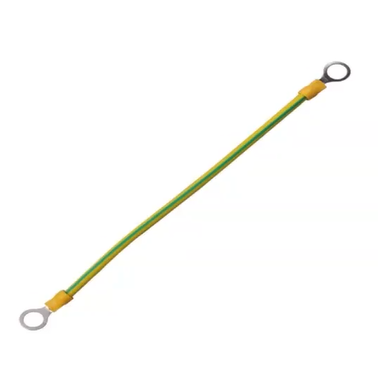
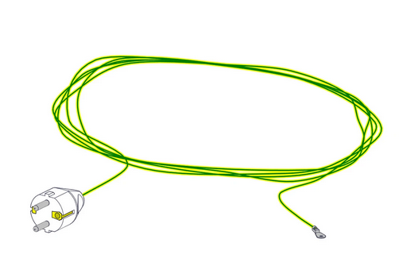
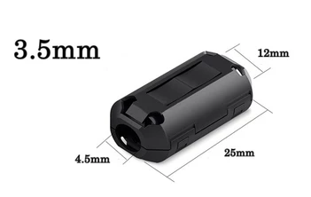
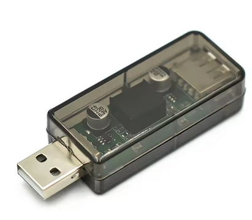

# Troubleshooting

## 9.1. Wheelbase Disconnection

If your wheelbase occasionally disconnects from the PC during use, this is usually related to USB signal instability, electrical noise (EMI), or system power quality.

**9.1.1. Quick check (important)**

Before trying all steps, identify your situation:

- Disconnect only under strong force (kerbs, impacts) → likely electrical noise (EMI)

- Random disconnect (even when idle) → likely USB or power issue

- Disconnect even in DFU mode → likely USB cable or hardware issue

- Works normally on another PC → likely PC USB environment issue

**Testing**

**Case 1: Disconnect under force (driving)**

- Reduce torque to **50%**

- Check if issue disappears

If yes → indicates a load-dependent issue

Further check:

- Gradually increase torque again (e.g., +10% each step) and observe the behavior

- If the issue occurs during sharp force spikes and the wheelbase temporarily powers off, then recovers after a few seconds → this strongly suggests power supply protection or instability

- If the disconnect occurs without a full power loss (device remains powered) → more likely related to EMI or grounding

If no → less likely related to load; may indicate general USB stability or hardware-related issue

**Case 2: Random disconnect**

**Test 1: EMC Stop**

- Disable motor output

- Check if disconnect still occurs

If stable → strongly suggests EMI or load-related interference

**Test 2: DFU Mode**

- Enter DFU mode

- Check if disconnect occurs

If yes → USB cable / hardware issue

**Test 3: Different PC**

Test on another PC or laptop. If it works normally → likely PC USB environment issue

**9.1.2. Step-by-step solution**

(For EMI / grounding issues and PC USB environment issues)

**Step 1: Use a direct motherboard USB connection**

Connect the wheelbase directly to a rear USB port on the motherboard.

Avoid:

- USB hubs

- Extension cables

- Monitor or keyboard USB ports

**Step 2: Keep USB cable away from power cables**

Ensure the USB cable is not routed alongside

- Wheelbase Power adapter cable

- Other high-power cables

Keep at least 20--30 cm distance if possible.

**Step 3. Ground the rig to the PC case**

If you are using a metal rig, connect it to the PC case using a wire (or grounding cable):

Rig / Wheelbase → a wire (or grounding cable)→ PC Case

This helps reduce electrical noise and improves stability.

**Step 4: Ensure proper grounding of the PC**

For best results, the PC should be connected to a properly grounded power outlet (3-pin with earth).

In advanced setups, a dedicated grounding connection (earth-only plug or grounding wire) can be used to connect the rig or PC case to a verified earth ground.

⚠️ Only perform this if you are familiar with proper electrical grounding and safety.

**Step 5: Try a different USB port**

- Use another rear USB port

- Avoid front panel ports

- If multiple USB devices are connected, try moving the wheelbase to a different USB port group (different controller if possible)

**Step 6: Try a shorter USB cable**

If available, use a cable shorter than 1.5 m. Shorter cables are less sensitive to interference.

**Step 7: Add ferrite clamps**

Attach ferrite clamps to the USB cable, preferably near the device side (e.g., wheelbase).

If multiple USB devices are connected (pedals, shifters, button boxes, etc.), consider adding ferrite clamps to those cables as well.

Electrical noise can travel through USB connections between devices and the PC. In some cases, noise generated by one device may affect others through the shared USB system.

Using ferrite clamps on multiple devices can help reduce overall system noise and improve stability.

**Step 8: Check power stability**

- Avoid overloaded power strips

- Avoid sharing power with high-power devices

- If using a surge protector or power strip, try connecting the PC directly to a wall outlet as a test. Some surge protectors may introduce additional noise or grounding issues, especially in high-power setups

**Step 9: Check power stability**

In high electrical noise environments, a USB isolator with isolated power may help improve stability. This is not required in most setups.

**If the issue still occurs, please provide the following information:**

**A. Basic Information**

- Are you using a USB hub?

- Are you using the original USB cable?

- Is the rig grounded to the PC case?

- Your PC specifications (CPU and motherboard)

- List of connected sim racing devices (wheelbase, pedals, shifter, motion system, etc**.)**

**B. When does the issue occur?**

- Under force (during driving)

- Randomly (including idle or light use)

- Immediately after plugging in

**C. Additional details (if possible)**

- Does the device fully power off, or only disconnect from USB?
